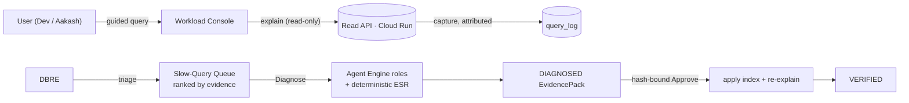
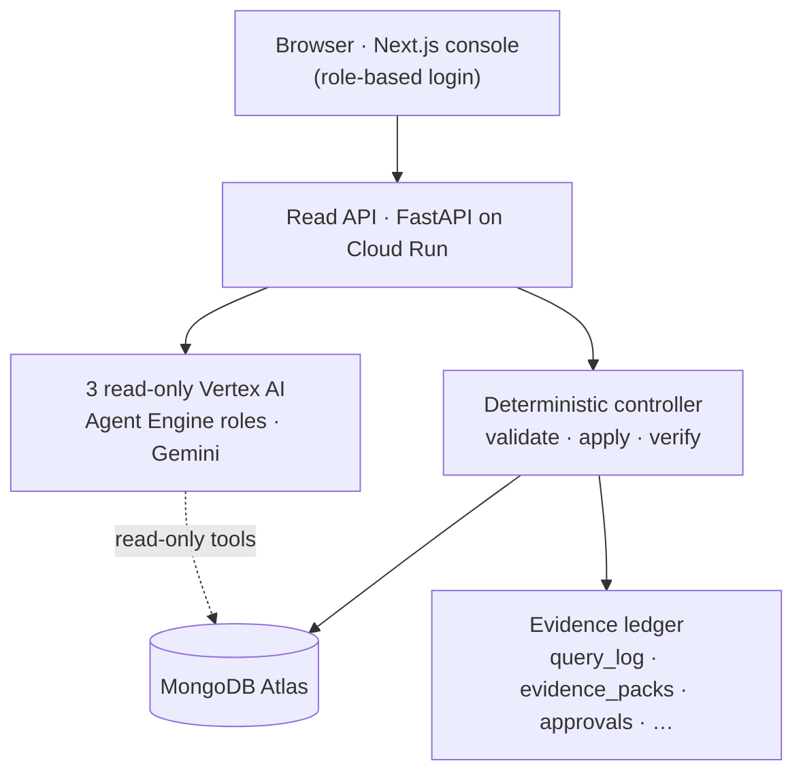

# Evidence-Driven DBRE Agent

> A MongoDB reliability agent that watches real query workloads, catches the slow ones with
> hard `explain` evidence, and won't touch an index until a human approves the exact hash it
> reviewed — then proves the fix worked.


Two personas, one performance loop: **users** run real queries against a live collection; a
**DBRE** triages the *actual* slowest ones, and a Gemini-powered agent proposes an ESR-correct
index that a deterministic controller applies and verifies — behind a hash-bound human gate.

## Table of contents

- [The idea](#the-idea)
- [What makes it different](#what-makes-it-different)
- [The two-persona flow](#the-two-persona-flow)
- [Architecture](#architecture)
- [The remediation lifecycle](#the-remediation-lifecycle)
- [Partner integration — MongoDB via MCP](#partner-integration--mongodb-via-mcp)
- [Safety model](#safety-model)
- [Tech stack](#tech-stack)
- [Repo layout](#repo-layout)
- [Getting started](#getting-started)
- [The demo walk](#the-demo-walk)
- [License](#license)

---

## The idea

Slow MongoDB queries are usually a missing or mis-ordered index. The fix is risky (a wrong index
makes it worse), the diagnosis is fiddly (Equality → Sort → Range key order), and the audit trail
is thin (who approved what, and did it actually help?). This project turns that into a safe,
evidence-driven loop: **agents recommend, deterministic code decides, humans approve, and
verification proves.**

## What makes it different

| Most "AI DBA" demos | This |
|---|---|
| One canned query, forever | Real user workload, captured and attributed per user |
| The LLM applies the change | The LLM only *recommends*; deterministic code decides and mutates |
| "Trust the model" | A **hash-bound human approval** is required before any index is created |
| "It looks faster" | A re-`explain` proves the blocking SORT is gone and docs-examined dropped |
| A chat box | A multi-step task: detect → diagnose → approve → apply → verify |

## The two-persona flow



A user runs a guided, read-only query; its real `explain` evidence is captured to `query_log`,
attributed to them. The DBRE sees the slowest captured queries — ranked by **evidence** (blocking
sort, collection scan, docs-examined-to-returned ratio), not wall-clock — picks one, and drives it
through diagnosis to a verified fix.

## Architecture



- **Dashboard** — Next.js (App Router). Seeded role-based login on an httpOnly session cookie; the
  user persona is confined to the workload console, the DBRE to the triage + review planes. The
  read API re-verifies the session bearer on every call and derives the approver from it.
- **Read API** — FastAPI on Cloud Run. Validated read-only workload queries, evidence capture, the
  evidence-ranked queue, and the DIAGNOSE → (human APPROVE) → VERIFY flow.
- **Diagnosis** — a pure, deterministic ESR analyzer derives the correct index key order from each
  query's own equality/sort/range structure. In production, three read-only Vertex AI Agent Engine
  roles (Gemini) narrate it; locally the controller runs deterministically.
- **State** — MongoDB Atlas: `users`, `query_log`, `evidence_packs`, and the internal ledger
  collections. The dashboard reads only `EvidencePack` v1 JSON, frozen in `contracts/`.

## The remediation lifecycle

`DIAGNOSE` (read-only) → `APPROVE` (human, hash-bound) → `VERIFY`. A pack is marked **VERIFIED**
only if a strict three-check rail passes on the re-`explain`: the blocking **SORT is removed**,
the **recommended index is the one used**, and **at least one metric improves**. Otherwise it
stays `APPROVED` (applied but not proven). The `evidence_hash` binds the before-evidence to the
recommendation, so an approval can only apply the exact fix the human saw.

## Partner integration — MongoDB via MCP

The agent reads MongoDB through MongoDB's official **MCP server** (`mongodb-mcp-server`). Prove it
live in one command — it spawns the MCP server, runs the MCP handshake, calls the `explain` tool
against Atlas, and prints the HIGH finding + ESR recommendation derived from the real plan:

```bash
uv run --with python-dotenv python -m agents.run
```

The MCP wiring lives in `agents/agent.py` (`build_mcp_toolset`, ADK `MCPToolset`) and
`agents/run.py` (raw stdio JSON-RPC). In the managed Vertex AI Agent Engine runtime the same
read-only operations run as native Python tools (`agents/native_mongo_tools.py`) because MCP's
stdio transport can't run inside that sandbox — so the MCP integration is demonstrated locally /
controller-side and the production agent uses the native equivalents.

## Safety model

| Guarantee | How |
|---|---|
| Agents are read-only | Tool allowlist; only the deterministic controller mutates |
| Mutation is gated | A one-time, hash-bound human approval ticket is required to apply |
| Approver is authoritative | Derived from the verified DBRE session — never the browser |
| Queries are safe | Guided builder, allowlist-validated, capped limit + `maxTimeMS`, no raw filters |
| No secrets in code | `.env` (local) / Secret Manager (prod); nothing committed |
| Everything is audited | Each phase writes to the ledger collections |

## Tech stack

| Layer | Technology |
|---|---|
| Agent | Gemini · Vertex AI Agent Engine (3 read-only roles) |
| Partner tool | MongoDB MCP server (`mongodb-mcp-server`) |
| Backend | FastAPI · Python 3.12 · pymongo |
| Frontend | Next.js (App Router) · TypeScript |
| Data | MongoDB Atlas |
| Hosting | Google Cloud Run · Secret Manager · Cloud Build |
| Contract | EvidencePack v1 (frozen JSON schema) |

## Repo layout

```text
.
├── api/          # FastAPI read API: routes, auth, workload, Agent Engine wiring
├── controller/   # deterministic core: ESR diagnosis, orchestrator, EvidencePack, ledger
├── agents/       # Vertex AI Agent Engine roles + MongoDB MCP integration
├── dashboard/    # Next.js operator console (login, workload, DBRE queue, run review)
├── seed/         # demo data + workload-baseline + account seeding
├── contracts/    # frozen EvidencePack v1 JSON schema
├── deploy/       # Cloud Run deploy script + runbook
└── tests/        # unit, contract, and live integration tests
```

## Getting started

```bash
uv sync --dev
cp .env.example .env     # fill MongoDB + (prod) Vertex values; set SESSION_SECRET + RUN_API_TOKEN

# one-time data + accounts (against your Atlas cluster)
uv run python seed/seed_demo_fixture.py seed   # 300k demo docs
uv run python seed/seed_workload.py verify     # baseline indexes + prove the trap presets
uv run python seed/seed_users.py               # seed the demo accounts — prints passwords once

uv run pytest -q                                # unit + contract (live integration auto-skips)
```

Run the full stack locally (deterministic controller, no Vertex needed):

```bash
SS=$(openssl rand -hex 32); RT=$(openssl rand -hex 16)
# read API (reads Atlas via MDB_MCP_CONNECTION_STRING from .env)
SESSION_SECRET=$SS RUN_API_TOKEN=$RT uv run uvicorn api.server:app --port 8000
# dashboard — SAME SESSION_SECRET + RUN_API_TOKEN, API_URL -> the read API
cd dashboard && npm install && \
  API_URL=http://127.0.0.1:8000 SESSION_SECRET=$SS RUN_API_TOKEN=$RT npm run dev
```

Re-run `seed/seed_workload.py reset` between demos — an approved fix removes the trap for a whole
store/method class. Cloud Run deploy: `deploy/cloudrun.md` + `dashboard/DEPLOY.md`.

## The demo walk

1. **Dev Trivedi** logs in to the workload console.
2. Runs a few guided queries against the live 300k-doc collection.
3. **Aakash Singh** logs in and runs a few more — each capture is attributed to its user.
4. **DBRE** logs in to the Slow-Query Queue, ranked by evidence.
5. Picks the worst query and clicks **Diagnose**.
6. Reviews the `EvidencePack` — finding, ESR recommendation, and the evidence hash.
7. **Approves** the hash-bound fix.
8. The backend applies the recommended index.
9. Verification re-`explain`s: **SORT removed**, docs-examined collapses (e.g. 100,073 → 25).
10. The system map shows the path: browser → Cloud Run API → Agent Engine roles → deterministic
    controller → MongoDB + ledger.

## License

Apache-2.0 — see [`LICENSE`](LICENSE).

---

_Built for the Google Cloud Agents challenge · MongoDB partner track._
