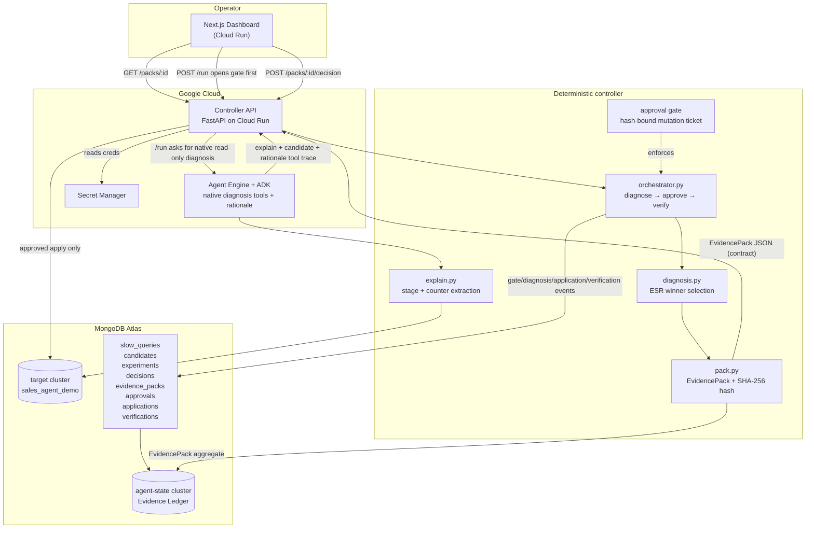

# Architecture — Evidence-Driven DBRE Agent

A Gemini-powered MongoDB performance engineer. It detects a slow query, diagnoses
the root cause from real `explain` evidence, proposes the correct ESR index,
gates the apply behind human approval, verifies the result, and ships a
**hashed evidence pack** plus an internal event ledger for every fix.

Five operator-facing **stages** sit over a three-phase safety **engine**
(Diagnose → Approve → Verify), itself the core of the original seven-phase
plan-and-execute design.

## System diagram

## The five stages → three-phase engine

| Stage (UI) | Engine phase | What happens | Who does it |
|------------|-------------|--------------|-------------|
| **Gate** | (pre) | Approval gate opens before diagnosis; mutation is blocked | **human gate / controller** |
| **Detect** | (pre) | Slow query surfaced from the fixture / logs | Agent Engine native tool |
| **Diagnose** | `DIAGNOSE` | Read `explain`, extract stages + counters, identify the blocking-sort root cause | Agent Engine native tools, deterministic code validates |
| **Test** | `DIAGNOSE` | Compare B vs C and propose index **C** (correct ESR) from measured evidence | Agent Engine native tools, deterministic code recomputes |
| **Approve** | `APPROVE` | Human reviews the evidence pack and approves/rejects, keyed to `evidence_hash` | **human gate** |
| **Verify** | `VERIFY` | Apply the approved index, re-`explain`, confirm the sort is gone | deterministic |

## Why this is an agent, not a chat loop

Three things make it a real plan-and-execute system (and the reason we run on
**Agent Engine + ADK**, not the no-code console):

1. **Gate-first control plane** — `/run` opens an approval gate before diagnosis,
   and every emitted pack records that gate plus the required evidence hash.
2. **Hash-bound approval ticket** — the controller blocks at `APPROVE` until a
   decision arrives carrying the matching `evidence_hash`. Only the decision
   route can issue the one-time ticket required by `apply_and_verify`; stale
   hashes or legacy ungated packs return `409`.
3. **Gemini never decides or applies** — Agent Engine can gather read-only evidence,
   propose, and explain, but the *winner selection*, the *hash*, the *apply*, and the
   *verification* are deterministic Python.

## The contract boundary

The dashboard depends on **one thing only**: `EvidencePack` JSON
(`contracts/evidence_pack.schema.json`). It never imports `controller/`,
`agents/`, or any backend module — it reads packs from the API and POSTs
decisions back. Backend internals can change freely behind the frozen `v1`
schema.

`EvidencePack.approval_gate` and `EvidencePack.agent_trace` are the visible
architecture proof: the first trace event is the approval gate opening, followed by
Agent Engine tool events, deterministic validation, human approval, apply, and verify.

The internal Evidence Ledger is richer than the dashboard contract. MongoDB
stores event collections for `slow_queries`, `candidates`, `experiments`,
`decisions`, `approvals`, `applications`, and `verifications`, plus the
`evidence_packs` aggregate the dashboard reads.
