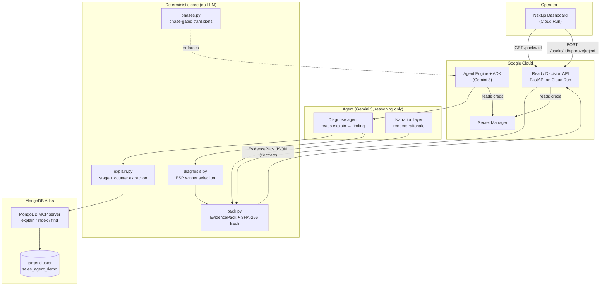

# Architecture — Evidence-Driven DBRE Agent

A Gemini-powered MongoDB performance engineer. It detects a slow query, diagnoses
the root cause from the real `explain` plan, proposes the correct index with a
*predicted* plan change, gates the apply behind human approval, and ships a
**hashed evidence pack** for every fix.

Five operator-facing **stages** sit over a three-phase safety **engine**
(Diagnose → Approve → Verify), itself the core of the original seven-phase
plan-and-execute design.

## System diagram

## The five stages → three-phase engine

| Stage (UI) | Engine phase | What happens | Who does it |
|------------|-------------|--------------|-------------|
| **Detect** | (pre) | Slow query surfaced from the fixture / logs | deterministic |
| **Diagnose** | `DIAGNOSE` | Read `explain`, extract stages + counters, identify the blocking-sort root cause | Gemini reads, deterministic code extracts |
| **Test** | `DIAGNOSE` | Propose index **C** (correct ESR) with a *predicted* plan change | Gemini proposes, code validates |
| **Approve** | `APPROVE` | Human reviews the evidence pack and approves/rejects, keyed to `evidence_hash` | **human gate** |
| **Verify** | `VERIFY` | Apply index on a scratch namespace, re-`explain`, confirm the sort is gone | deterministic |

## Why this is an agent, not a chat loop

Three things make it a real plan-and-execute system (and the reason we run on
**Agent Engine + ADK**, not the no-code console):

1. **Phase-gated tools** (`controller/phases.py`) — a write/apply tool cannot be
   called outside the `VERIFY` phase; transitions are asserted, illegal jumps
   raise.
2. **Human-in-loop pause** — the controller blocks at `APPROVE` until a decision
   arrives carrying the matching `evidence_hash`. The API returns `409` if the
   hash is stale (the evidence changed under the operator).
3. **Gemini never decides or applies** — it reads explain summaries and proposes;
   the *winner selection*, the *hash*, and the *apply* are deterministic Python.
   The LLM renders the rationale; it never computes it.

## The contract boundary

The dashboard depends on **one thing only**: `EvidencePack` JSON
(`contracts/evidence_pack.schema.json`). It never imports `controller/`,
`agents/`, or any backend module — it reads packs from the API and POSTs
decisions back. Backend internals can change freely behind the frozen `v1`
schema.
